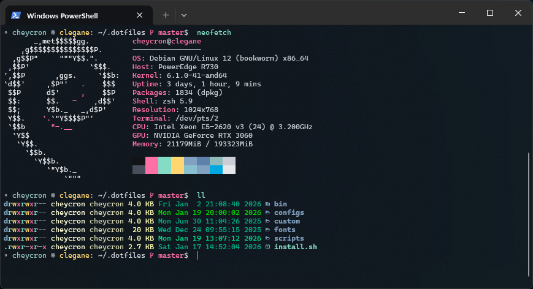

# [Flatcap](https://github.com/cheycron/flatcap-theme) for Windows Terminal

 

**[Flatcap](https://github.com/cheycron/flatcap-theme)** is a dark, minimalist, and eye-friendly theme meticulously crafted to provide a comfortable and focused experience.

<p align="center">
  
</p>

## 🚀 How to Install

> [!WARNING]
> **Disclaimer:** Do not replace your entire `settings.json` file with the content of `app-windows-terminal.json`. Instead, follow the steps below to add the color scheme manually.

1.  **Open Settings**: In Windows Terminal, open the **Settings** tab (`Ctrl + ,`). Click on **Open JSON file** at the bottom-left.
2.  **Add the Color Scheme**: Find the `schemes` array and paste the following object:

    ```json
    {
      "name": "Flatcap",
      "background": "#121418",
      "foreground": "#cbced5",
      "cursorColor": "#88c0d0",
      "selectionBackground": "#2e3440",
      "black": "#191c22",
      "red": "#bf616a",
      "green": "#a3be8c",
      "yellow": "#ebcb8b",
      "blue": "#81a1c1",
      "purple": "#b48ead",
      "cyan": "#8fbcbb",
      "white": "#cbced5",
      "brightBlack": "#484f5c",
      "brightRed": "#bf616a",
      "brightGreen": "#a3be8c",
      "brightYellow": "#ebcb8b",
      "brightBlue": "#81a1c1",
      "brightPurple": "#b48ead",
      "brightCyan": "#88c0d0",
      "brightWhite": "#e4e6e9"
    }
    ```

3.  **Apply the Theme**: Find your profile (e.g., PowerShell, WSL) and add:
    ```json
    "colorScheme": "Flatcap"
    ```
4.  **Save**: Windows Terminal will automatically apply the changes.

---

## 🎨 Philosophy & Design

**[Flatcap](https://github.com/cheycron/flatcap-theme)** draws inspiration from the *Nord theme*, embracing principles of calm, clean aesthetics, and a dimmed pastel color approach.

### Color Palette

| Family | Description |
| :--- | :--- |
| **Deep Twilight** | Structural foundation. Deep, matte backgrounds (`#121418`) to create focus. |
| **Dawnlight** | Typography hierarchy. From muted metadata (`#b2b6bf`) to crisp body text (`#cbced5`). |
| **Ocean Blues** | Primary interaction. Calming blues (`#81a1c1`) for actions and navigation. |
| **Vivid Accents** | Semantic feedback. Desaturated accents for errors (`#bf616a`) and success (`#a3be8c`). |

## ✒️ Typography & Fonts

For the best visual experience, **[Flatcap](https://github.com/cheycron/flatcap-theme)** recommends using:

*   **[Cascadia Code NF](https://github.com/microsoft/cascadia-code/releases)** (Includes Nerd Font icons).

### Recommended Profile Settings

```json
{
  "font": {
    "face": "Cascadia Code NF"
  },
  "padding": "20, 20, 20, 20",
  "cursorShape": "bar"
}
```

---

<p align="center">
  Distributed under the MIT License.
</p>

<p align="center">
  <a href="https://www.buymeacoffee.com/cheycron">
    
  </a>
</p>